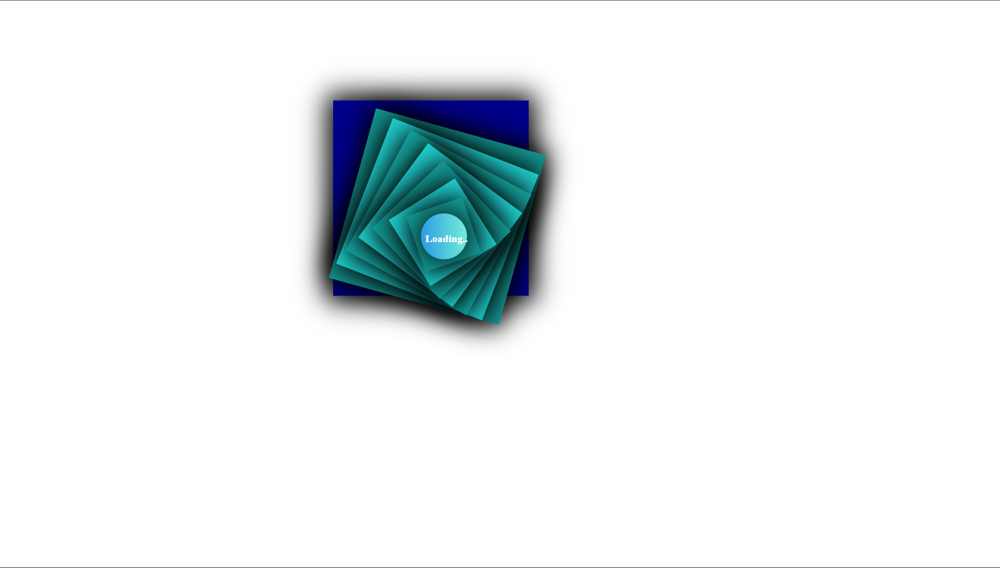

---
#  3D Loading Design

A visually captivating, purely CSS-driven 3D loading animation. This project was built "just for fun" to experiment with geometric layering, depth, and smooth transitions in the browser.

##  Demo

 

##  Features

*   **Pure CSS & HTML:** No JavaScript required for the animation.
*   **3D Layering:** Uses stacked elements to create a spiral depth effect.
*   **Smooth Transitions:** Fluid motion designed for a modern user interface feel.
*   **Minimalist Design:** Teal and navy color palette with a glowing center focal point.

##  Built With

*   **HTML5** - Structure of the animation layers.
*   **CSS3** - Keyframe animations, 3D transforms, and shadow effects.

## 🏁 Getting Started

To run this project locally:

1.  **Clone the repository:**
    ```bash
    git clone [https://github.com/Adhieeeh/3D_loading_design.git](https://github.com/Adhieeeh/3D_loading_design.git)
    ```
2.  **Open the project:**
    Simply open the `index.html` file in any modern web browser.

## That looks like a really sleek, hypnotic loading animation! Since it's a "just for fun" project, the README should be clean and highlight the visual impact of your CSS skills.


